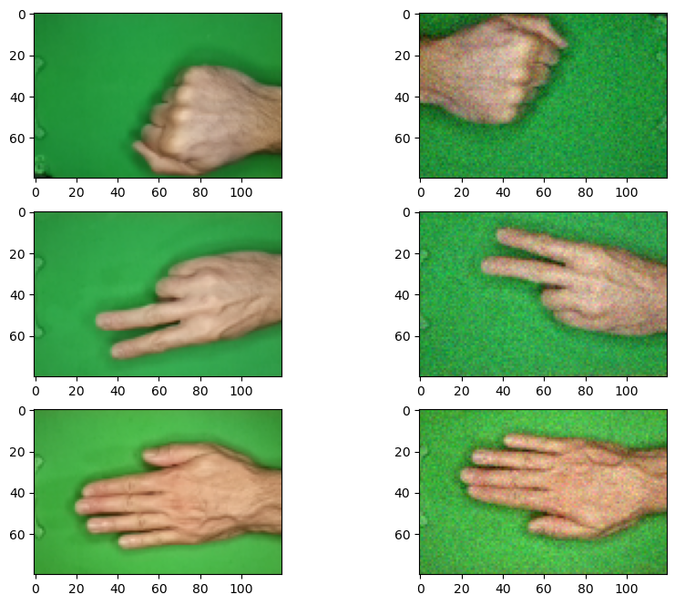
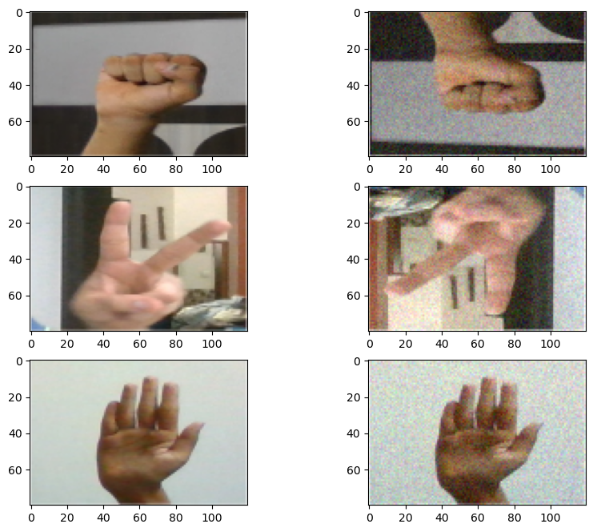
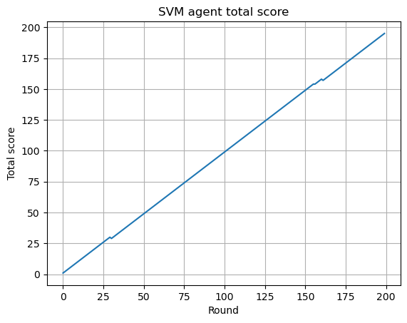
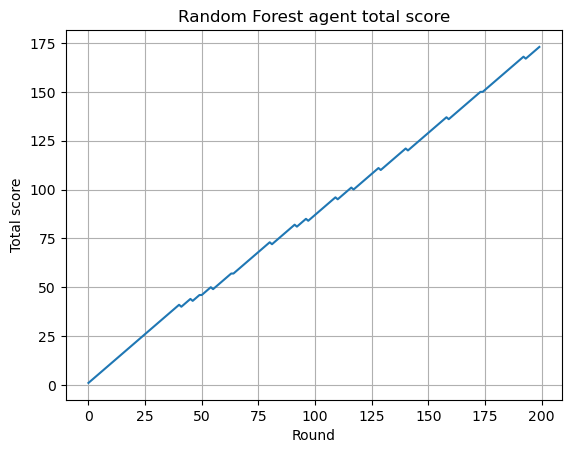
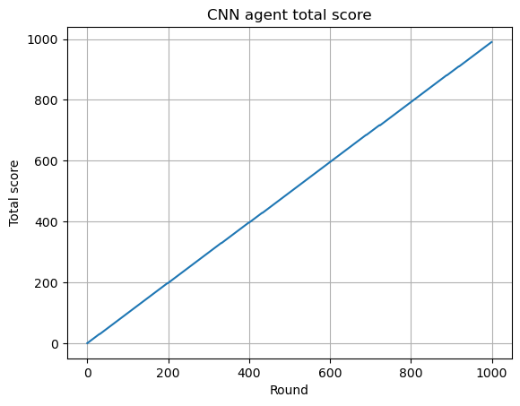
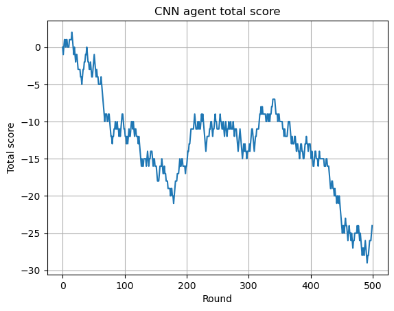
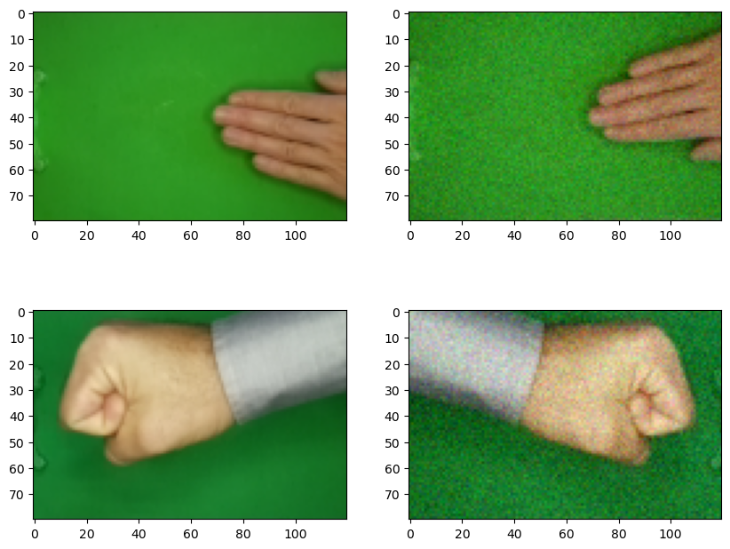

# rock-paper-scissors-classification
Rock paper scissors classification using SVM, Random Forest and CNN

## Dependancies:
- Numpy
- Matplotlib
- Sklearn
- Tensorflow

## The dataset:

### Dataset 1
The main dataset can be found on [Kaggle](https://www.kaggle.com/datasets/drgfreeman/rockpaperscissors). It contains images of hand gestures infront of a green screen that represent a rock, a paper or scissors.
Here is a preview of the first dataset. On the left is the original image and on the right
it's the flipped image with added noise.

### Dataset 2
The second dataset can be found [here](https://www.kaggle.com/datasets/yash811/rockpaperscissors/data).

## Rock Paper Scissor game mechanics

In order to test the performance of the model/agent that we trained, it is placed in a game against a
random agent. This random agent picks a random image from the test set and performs the following actions:
- Flips the image horizontally with a 50% chance
- Flips the image vertically with a 50% chance
- Adds noise from a Gaussian Distribution (with a standard deviation of 0.05 * MAX_VALUE)

The game is played in rounds.
Each round, the trained agent has to read that image and take the appropriate action to beat the random
agent. If the round is won, the agent gains 1 point, if it's a tie 0 points and if it's a loss -1.
The accumulated score is presented at the end of the game.

## Implementation steps:

### Train test split

We split the dataset into a train and test set with a 70-30% split.

### Data augmentation

For the train set, we flip the images on every axis (vertically, horizontally, vertically and horizontally). This way we cover every possible action that the random agent can take. 
Afterward, we apply a Gaussian Noise on the images. 

### Dimensionality Reduction

Before reducing the dimensions we flatten the input in order to make it compatible with the SVM and Random
Forest algorithms.
We perform dimensionality reduction on the dataset using KPCA. This reduction will only be used for the classifiers that use 1D arrays as the input data.
CNN inputs are 2D images (with a third dimensions for the channel) meaning that KPCA is not applicable.

### Hyperparameter grid search

We perform a gridsearch on the parameters of the estimator in order to find the best ones.

### Evaluating the model

The model/agent is evaluated by its ability to beat the random agent, in other words, accumulate as many
points as possible.

## Agent results preview

### SVM

For 200 rounds the SVM had the following outcome

| wins | losses | ties | total score |
|------|--------|------|-------------|
| 197  | 2      | 1    | 195         | 

### Random Forest

For 200 rounds the Random Forest had the following outcome

| wins | losses | ties | total score |
|------|--------|------|-------------|
| 185  | 12     | 3    | 173         |

### CNN

For 1000 rounds the CNN had the following outcome

| wins | losses | ties | total score |
|------|--------|------|-------------|
| 991  | 1      | 8    | 990         |

## CNN agent on the new dataset

When evaluating the CNN agent on the new dataset for 500 rounds the results are dramatically worse. The close values
between wins losses and ties suggests that the agent doesn't really know how to make a decision and
picks an action at random. This can be attributed to the big difference between the two dataset and the
inability of the model to generalize.

| wins | losses | ties | total score |
|------|--------|------|-------------|
| 150  | 174    | 176  | -24         |

## Misclassification cases

In the cases above, the agent made wrong predictions. On the left side it’s the original image and on the right side it’s the image provided by the random agent.
Specifically, for the first case, the agent predicted a rock when the image shows a paper gesture. Half of the hand in the image is off the frame, 
this is perhaps the reason from the wrong classification.
In the second case the agent predicted paper instead of rock. The sleeve of the shirt which has a darker colour, and it’s not common in the dataset,
is also visible in the image. The interfering sleeve might be the reason for this misclassification

## Conclusions

In this notebook, we have showcased the ability of different machine learning algorithms to learn from a 
set of images and make correct predictions in a game of rock paper scissors against a random agent. Although
the performance of all the models was adequate to guarantee a high winrate against the agent, when
presented with a new dataset, the results were less than satisfactory. Once again, this is an indication
of the inability of these models to generalize and the need for a robust and unbiased dataset.
